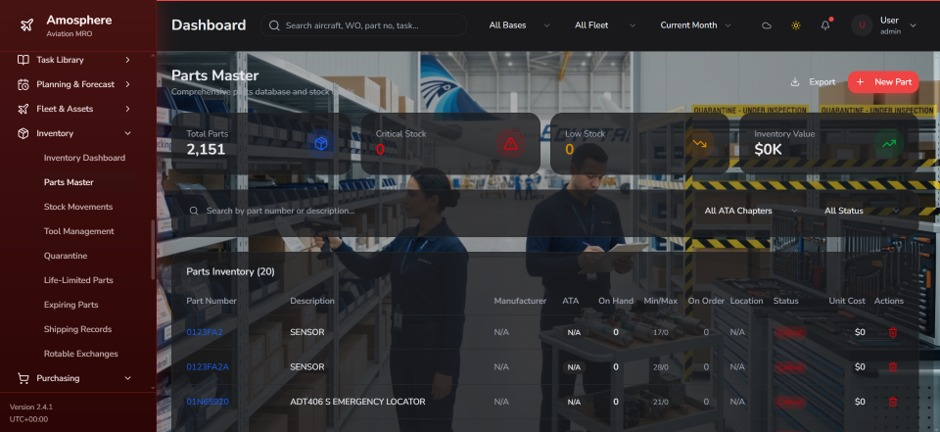

# ✈️ AMOSPHERE

### AI-Powered Aviation Maintenance, Repair & Overhaul (MRO) Platform

An intelligent enterprise-grade platform that transforms aircraft maintenance operations through Artificial Intelligence, predictive maintenance, and digitalized Maintenance, Repair, and Overhaul (MRO) management.

---

# 📖 Overview

AMOSPHERE is an AI-powered Maintenance, Repair, and Overhaul (MRO) platform developed as a Computer Engineering graduation project. The platform provides airlines and aviation maintenance organizations with a unified digital solution for managing maintenance operations, work orders, inventory, scheduling, reporting, and predictive maintenance.

Instead of relying on fragmented systems and manual workflows, AMOSPHERE centralizes maintenance activities into a single intelligent platform that improves operational efficiency, enhances aircraft reliability, reduces downtime, and supports data-driven maintenance decisions.

---

# ✨ Key Features

- Aircraft Maintenance Management
- Work Order Management
- Preventive & Corrective Maintenance
- Predictive Maintenance using Artificial Intelligence
- Inventory & Spare Parts Management
- Maintenance Scheduling
- Interactive Dashboards
- Reports & Analytics
- User Authentication & Role Management
- Notifications & Activity Tracking

---

# 🤖 Artificial Intelligence

AMOSPHERE integrates Artificial Intelligence to support maintenance planning and operational decision-making.

### Finding Risk Prediction

A machine learning model analyzes maintenance findings and operational data to estimate the probability of future maintenance issues before they become critical.

### Spare Parts Demand Forecasting

The platform predicts future spare-parts demand by combining scheduled maintenance information with historical maintenance events, helping maintenance teams optimize inventory levels and reduce unnecessary stock costs.

### AI Benefits

- Reduce unexpected aircraft downtime
- Improve maintenance planning
- Increase fleet availability
- Optimize spare-parts inventory
- Support proactive maintenance decisions

---

# 🏗️ System Modules

- User Management
- Aircraft Management
- Maintenance Management
- Work Orders
- Inventory Management
- Warehouse Management
- Maintenance Scheduling
- Reports & Analytics
- Dashboard
- AI Prediction Module

---

# 🏛️ System Architecture

The platform follows a layered architecture that separates presentation, business logic, data management, and AI services.

### Presentation Layer

- React Web Application
- Responsive User Interface

### Backend Layer

- Spring Boot REST APIs
- Authentication & Authorization
- Business Logic

### Database Layer

- MySQL Relational Database

### AI Layer

- Python
- Scikit-learn
- Machine Learning Models

This architecture ensures scalability, maintainability, modularity, and seamless integration between operational modules and AI services.

---

# 💻 Technology Stack

## Frontend

- React
- HTML5
- CSS3
- JavaScript

## Backend

- Spring Boot
- Java
- REST API

## Database

- MySQL

## Artificial Intelligence

- Python
- Scikit-learn
- Pandas
- NumPy

## Tools

- Git
- GitHub
- Postman
- Visual Studio Code
- IntelliJ IDEA
- Figma

---

# 📷 Screenshots

## Login

---

## Dashboard

---

## Work Orders

> Add Work Orders Screenshot

---

## Inventory

---

## Reports

> Add Reports Screenshot

---

## AI Prediction

> Add AI Prediction Screenshot

---

# 🎯 Project Objectives

- Improve operational safety
- Reduce aircraft downtime
- Increase fleet availability
- Enhance maintenance planning
- Optimize inventory management
- Support predictive maintenance
- Enable data-driven decision making

---

# 📚 Documentation

The complete graduation project documentation includes:

- Software Engineering Documentation
- System Architecture
- UML Diagrams
- Database Design
- Artificial Intelligence Design
- Testing & Validation
- Implementation Details

---

# 🚀 Future Enhancements

- Mobile Application
- Cloud Deployment
- IoT Integration
- Digital Twin Support
- Real-Time Aircraft Monitoring
- Advanced Deep Learning Models
- Automated Maintenance Recommendations

---

# 👥 Team

AMOSPHERE was developed as a multidisciplinary Computer Engineering graduation project following Agile software development practices.

---

# 📄 License

This project is shared for educational and portfolio purposes.
